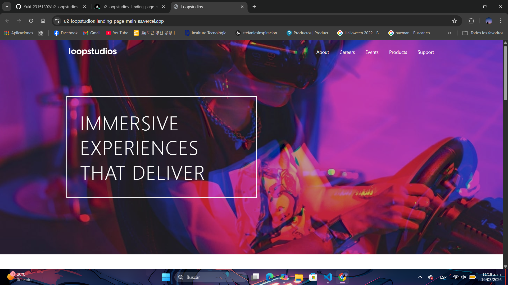
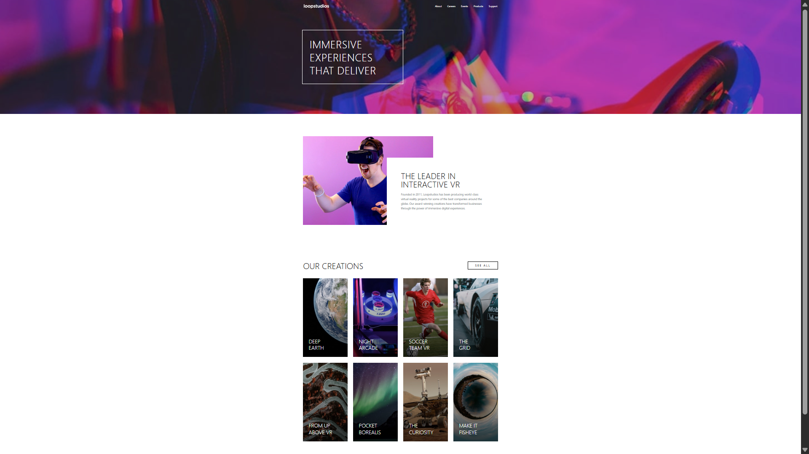
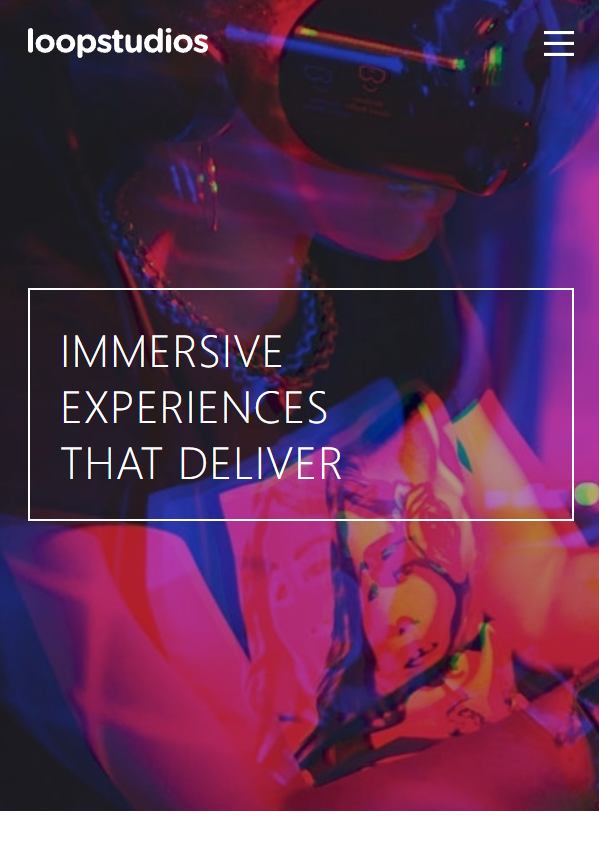
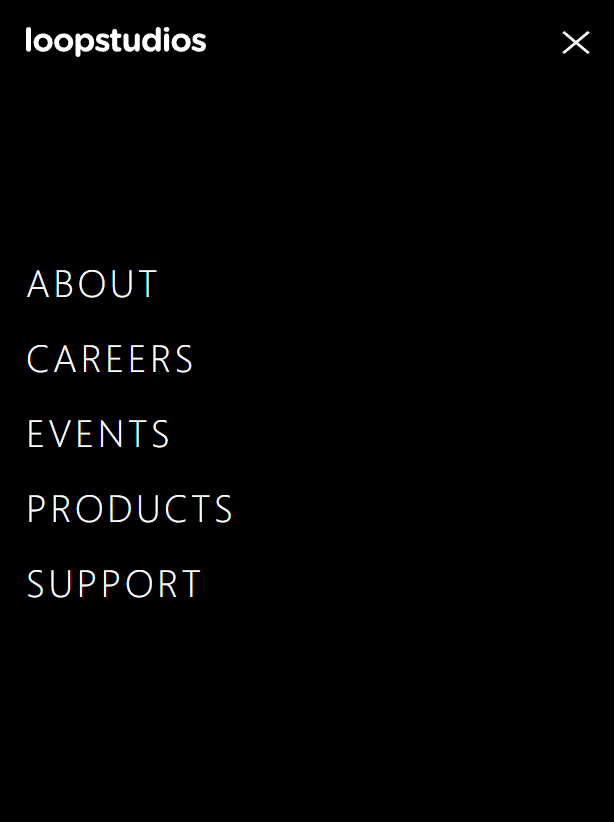

# 🏝️ Proyecto: Loopstudios Landing Page

Este proyecto consiste en el desarrollo de la **landing page de Loopstudios** utilizando **Astro** y **Tailwind CSS**.  
El objetivo es aplicar los conocimientos sobre **componentes de Astro**, **maquetación**, **estilos responsivos** y **utilidades CSS** para construir un diseño limpio, moderno y adaptable a diferentes dispositivos.

---

## 📖 Descripción general

### 🧩 Vista previa del proyecto


 

---

### 🔗 Enlaces del proyecto

- **Repositorio en GitHub:**  
https://github.com/Yuki-23151302/u2-loopstudios-landing-page-main-astro.git  

- **Sitio desplegado en Vercel:**  
https://u2-loopstudios-landing-page-git-12774a-yuki-23151302s-projects.vercel.app/

---

## 🧠 Proceso de desarrollo

### 🛠️ Tecnologías utilizadas

- Astro (framework principal)
- Tailwind CSS (estilos)
- HTML5 semántico
- Diseño responsivo (Mobile-first)
- Componentes reutilizables en Astro
- JavaScript para interacciones

---

## 🧱 Estructura del proyecto

```bash
src/
 ├── components/
 │   ├── Header.astro
 │   ├── Hero.astro
 │   ├── InteractiveSection.astro
 │   ├── Creations.astro
 │   └── Footer.astro
 ├── layouts/
 │   └── Layout.astro
 └── pages/
     └── index.astro
```

Esta estructura permite mantener el proyecto organizado y facilita la reutilización de componentes.

---

## 💡 Lo que aprendí

Durante el desarrollo de este proyecto reforcé varios conceptos importantes del desarrollo web moderno.

Aprendí a trabajar con **Astro**, organizando el proyecto mediante componentes reutilizables como `Header`, `Hero`, `InteractiveSection`, `Creations` y `Footer`, lo que facilita la escalabilidad y mantenimiento del código.

También mejoré mi uso de **Tailwind CSS**, aplicando clases utilitarias para construir el diseño sin necesidad de escribir mucho CSS personalizado, lo cual agiliza el desarrollo.

Otro punto importante fue el manejo del diseño responsivo, utilizando clases como `md:` para adaptar el diseño a diferentes tamaños de pantalla.

Además, implementé un **menú móvil interactivo** utilizando JavaScript para controlar el estado visual del menú.

### 📌 Ejemplo de implementación

```html
<button id="menu-btn" class="md:hidden">
  
</button>
```

```js
btn.addEventListener("click", () => {
  const isOpen = !menu.classList.contains("translate-x-full");
  menu.classList.toggle("translate-x-full");

  document.body.classList.toggle("overflow-hidden");
});
```

Este código permite mostrar y ocultar el menú móvil, además de bloquear el scroll cuando el menú está abierto.

---

## 🚀 Áreas de mejora

- Mejorar la implementación del menú móvil con más funcionalidades.
- Añadir animaciones más avanzadas para mejorar la experiencia de usuario.
- Optimizar el uso de Tailwind mediante configuraciones personalizadas.
- Implementar mejores prácticas de accesibilidad (a11y).
- Mejorar la organización del código para proyectos más grandes.

---

## 📚 Recursos útiles

- https://docs.astro.build  
- https://tailwindcss.com/docs  
- https://developer.mozilla.org/es/  
- https://web.dev/responsive-web-design-basics/  

---

## 👩‍💻 Autor

- Nombre completo: Elvia Yuridia Flores Dueñas  
- Carrera: Tecnologías de la Información y Comunicaciones  
- Grupo: --  
- Correo institucional: 23151302@aguascalientes.tecnm.mx  

---

## ✨ Reflexión final

El desarrollo de este proyecto fue una experiencia muy útil para consolidar mis conocimientos en el uso de Astro y Tailwind CSS.

Lo más fácil fue estructurar el proyecto utilizando componentes, ya que Astro facilita mucho la organización del código.  
Lo más desafiante fue lograr que el diseño fuera completamente responsivo y que coincidiera con la maqueta tanto en móvil como en escritorio.

La parte que más disfruté fue construir la sección de galería (Creations), ya que implicó trabajar con grids, efectos hover y adaptación de imágenes.

Este proyecto me permitió trabajar con un flujo más profesional de desarrollo front-end, separando responsabilidades y cuidando los detalles visuales. En el futuro, aplicaré estos conocimientos para desarrollar interfaces más complejas, optimizadas y escalables.
